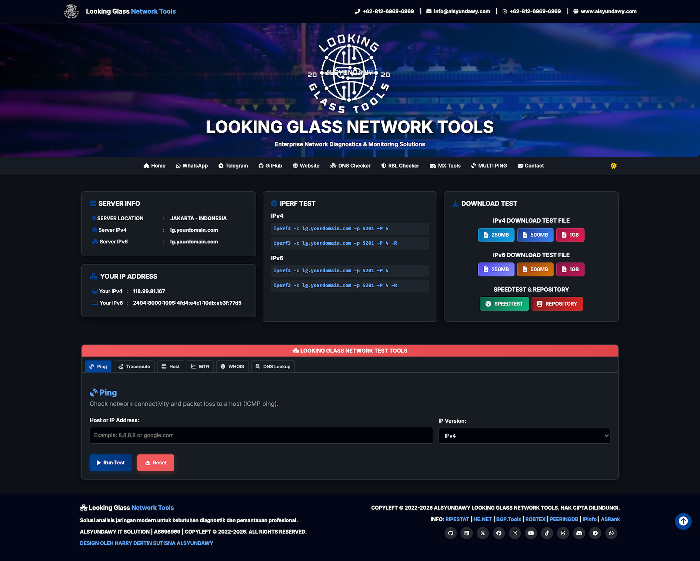
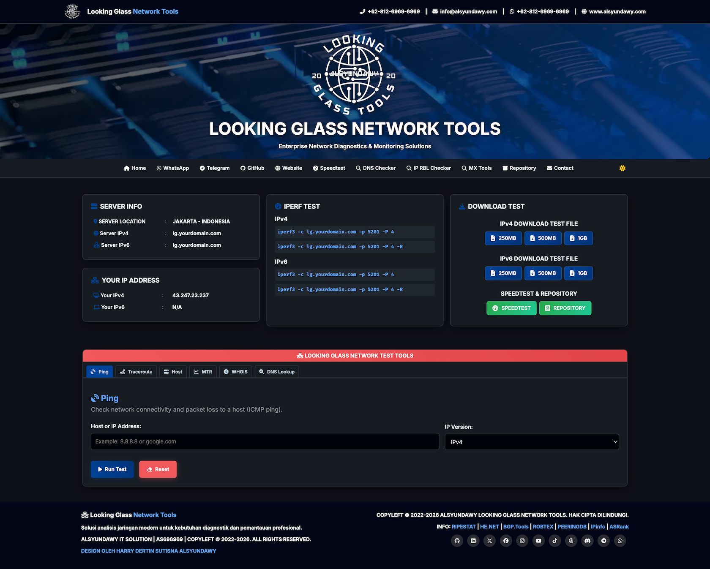

<!-- markdownlint-disable MD013 -->

# Alsyundawy PHP Looking Glass

[](https://github.com/alsyundawy/php-looking-glass/releases)

[](https://github.com/alsyundawy/php-looking-glass/releases)
[](https://github.com/alsyundawy/php-looking-glass/)
[](https://github.com/alsyundawy/php-looking-glass/blob/master/LICENSE)
[](https://github.com/alsyundawy/php-looking-glass/issues)
[](https://github.com/alsyundawy/php-looking-glass/pulls)
[](https://www.paypal.me/alsyundawy)
[](https://ko-fi.com/alsyundawy)
[](https://github.com/sponsors/alsyundawy)
[](https://github.com/alsyundawy/php-looking-glass/stargazers)
[](https://github.com/alsyundawy/php-looking-glass/network/members)
[](https://github.com/alsyundawy/php-looking-glass/graphs/contributors)

## Star History

<!-- markdownlint-disable MD033 -->
<a href="https://star-history.com/#alsyundawy/php-looking-glass&Date">
 <picture>
   <source media="(prefers-color-scheme: dark)" srcset="https://api.star-history.com/chart?repos=alsyundawy/php-looking-glass&type=Date&theme=dark" />
   <source media="(prefers-color-scheme: light)" srcset="https://api.star-history.com/chart?repos=alsyundawy/php-looking-glass&type=Date" />
   
 </picture>
</a>
<!-- markdownlint-enable MD033 -->

**A professional, lightweight, single-file PHP Looking Glass tool designed for network diagnostics. Fully compatible with IPv4 and IPv6, featuring a modern, responsive UI (Dark/Light mode) and utilizing standard system utilities.**

### User Interface

#### Version 1.1.1 (Latest)



#### Version 1.0.8



## Features

| Category                   | Details                                                                                            |
| -------------------------- | -------------------------------------------------------------------------------------------------- |
| 🌐 **Network Diagnostics** | Ping (ICMP), Traceroute, MTR, Host, WHOIS Lookup, DNS Lookup (A/AAAA/NS/MX/SOA/TXT)                |
| ⚡ **Performance Testing** | Iperf3 (TCP/UDP/Reverse), Customizable binary download tests                                       |
| 🎨 **Modern UI**           | Fully responsive (Mobile to 4K), Dark/Light mode toggle, Real-time client IP detection             |
| 🔒 **Security**            | CSRF protection, `proc_open()` argv (no shell interpolation), CSP headers, strict input validation |
| 🚀 **Easy Deployment**     | Single PHP file · No database · No Composer · PHP 8.1+                                             |

## Requirements

- **PHP**: Version 8.1 or higher.
- **PHP Extensions**: `filter` and `json` (strictly required), `mbstring` (recommended for multibyte string operations).
- **PHP Functions**: The following functions must not be disabled in `disable_functions` inside `php.ini`:
  - `proc_open`, `proc_get_status`, `proc_close`, `proc_terminate`
  - `stream_get_contents`, `stream_select`
  - `fread`, `fclose`
- **Web Server**: Nginx, Apache, Caddy, or any PHP-supported web server.
- **System Utilities**: The web server user must be able to execute the following commands:
  - `ping` (ICMP ping utility)
  - `traceroute` (route path diagnostics)
  - `mtr` (My Traceroute)
  - `iperf3` (performance testing utility)
  - `whois` (domain/IP WHOIS lookup)
  - `dig` or `host` (DNS lookup utilities, usually part of `bind-utils` or `dnsutils`)

---

## Installation Guide

### 1. Install System Dependencies through Terminal

**Debian/Ubuntu:**

```bash
sudo apt-get update
sudo apt-get install php-cli php-fpm php-json php-common php-mbstring php-xml ping traceroute mtr-tiny iperf3 dnsutils whois -y
```

**CentOS/RHEL/AlmaLinux:**

```bash
sudo dnf install php-cli php-fpm php-json php-common php-mbstring php-xml iputils traceroute mtr iperf3 bind-utils whois -y
```

### 2. Deployment

Simply download `ALSYUNDAWY-LG-GITHUB-2026.php` rename to `index.php` and upload it to your web server's public directory (e.g., `/var/www/html/lg/`).

### 3. Web Server Configuration

To ensure optimal performance, security, and functionality (especially for large downloads and long-running tests like MTR), please use the following configurations.

#### Option A: Nginx + PHP-FPM

Create a new server block or modify your existing one. This configuration includes **Gzip compression**, **Extended Timeouts**, **Security Headers**, and **IPv6 support**.

```nginx
server {
    # Listen on port 80 for both IPv4 and IPv6
    listen 80;
    listen [::]:80;

    server_name lg.yourdomain.com;
    root /var/www/html/lg;
    index index.php;

    # =========================================================================
    # PERFORMANCE & TIMEOUTS
    # =========================================================================
    # Allow large file uploads/downloads (Critical for Speedtest/Download Test)
    client_max_body_size 4096M;

    # Extended timeouts for long-running processes (MTR, Traceroute)
    client_header_timeout 86400;
    client_body_timeout 86400;
    fastcgi_read_timeout 86400;
    proxy_read_timeout 86400;

    # =========================================================================
    # SECURITY HEADERS & SETTINGS
    # =========================================================================
    server_tokens off;      # Hide Nginx version
    autoindex off;          # Disable directory listing
    http2 on;               # Enable HTTP/2 for better performance

    # Security headers
    add_header Vary Accept-Encoding;
    proxy_hide_header Vary;

    # =========================================================================
    # CUSTOM ERROR PAGES
    # =========================================================================
    error_page 400 /400.html;
    error_page 401 /401.html;
    error_page 402 /402.html;
    error_page 403 /403.html;
    error_page 404 /404.html;
    error_page 500 /500.html;
    error_page 502 /502.html;
    error_page 503 /503.html;

    # =========================================================================
    # GZIP COMPRESSION
    # =========================================================================
    gzip on;
    gzip_static on;
    gzip_disable "MSIE [1-6]\.(?!.*SV1)";
    gzip_http_version 1.1;
    gzip_min_length 1100;
    gzip_vary on;
    gzip_comp_level 7;
    gzip_proxied any;
    gzip_buffers 128 4k;
    gzip_types
        text/css
        text/javascript
        text/plain
        text/xml
        application/x-javascript
        application/javascript
        application/json
        application/vnd.ms-fontobject
        application/x-font-opentype
        application/x-font-truetype
        application/x-font-ttf
        application/xml
        application/font-woff
        application/atom+xml
        application/rss+xml
        application/x-web-app-manifest+json
        application/xhtml+xml
        font/eot
        font/opentype
        font/otf
        image/svg+xml
        image/vnd.microsoft.icon
        image/bmp
        image/png
        image/gif
        image/jpeg
        image/jpg
        image/webp
        image/x-icon
        text/x-component;

    # =========================================================================
    # LOCATION BLOCKS
    # =========================================================================
    location / {
        try_files $uri $uri/ =404;
    }

    location ~ \.php$ {
        include snippets/fastcgi-php.conf;
        # Adjust the socket path to match your PHP version (e.g., php8.1-fpm.sock)
        fastcgi_pass unix:/run/php/php8.1-fpm.sock;
        fastcgi_param SCRIPT_FILENAME $document_root$fastcgi_script_name;
        include fastcgi_params;
    }

    # Deny access to hidden files (e.g., .htaccess, .git)
    location ~ /\.ht {
        deny all;
    }
}
```

#### Option B: Apache + PHP

Ensure `mod_rewrite`, `mod_deflate`, `mod_headers`, and `mod_http2` are enabled.

```apache
<VirtualHost *:80>
    ServerName lg.yourdomain.com
    DocumentRoot /var/www/html/lg

    # =========================================================================
    # PROTOCOLS & SECURITY
    # =========================================================================
    # Enable HTTP/2 (Requires mod_http2)
    Protocols h2 http/1.1

    # Hide Apache version and signature
    ServerTokens Prod
    ServerSignature Off

    # =========================================================================
    # PERFORMANCE & TIMEOUTS
    # =========================================================================
    # Allow large uploads/downloads (4096M = 4294967296 bytes)
    LimitRequestBody 4294967296

    # Extended timeouts for long-running tests (MTR/Traceroute)
    # TimeOut directive in Apache (seconds)
    TimeOut 86400

    <Directory /var/www/html/lg>
        Options -Indexes +FollowSymLinks
        AllowOverride All
        Require all granted
    </Directory>

    # =========================================================================
    # CUSTOM ERROR PAGES
    # =========================================================================
    ErrorDocument 400 /400.html
    ErrorDocument 401 /401.html
    ErrorDocument 402 /402.html
    ErrorDocument 403 /403.html
    ErrorDocument 404 /404.html
    ErrorDocument 500 /500.html
    ErrorDocument 502 /502.html
    ErrorDocument 503 /503.html

    # =========================================================================
    # HEADERS
    # =========================================================================
    <IfModule mod_headers.c>
        Header append Vary Accept-Encoding
    </IfModule>

    # =========================================================================
    # GZIP COMPRESSION (mod_deflate)
    # =========================================================================
    <IfModule mod_deflate.c>
        AddOutputFilterByType DEFLATE text/css text/javascript text/plain text/xml
        AddOutputFilterByType DEFLATE application/x-javascript application/javascript application/json
        AddOutputFilterByType DEFLATE application/vnd.ms-fontobject application/x-font-opentype application/x-font-truetype
        AddOutputFilterByType DEFLATE application/x-font-ttf application/xml application/font-woff
        AddOutputFilterByType DEFLATE application/atom+xml application/rss+xml application/x-web-app-manifest+json application/xhtml+xml
        AddOutputFilterByType DEFLATE font/eot font/opentype font/otf
        AddOutputFilterByType DEFLATE image/svg+xml image/vnd.microsoft.icon image/bmp image/x-icon
    </IfModule>
</VirtualHost>
```

### 4. SSL Installation (Certbot)

Secure your Looking Glass with HTTPS using Let's Encrypt.

**Install Certbot:**

_Debian/Ubuntu:_

```bash
sudo apt-get install certbot python3-certbot-nginx python3-certbot-apache -y
```

_CentOS/RHEL:_

```bash
sudo dnf install certbot python3-certbot-nginx python3-certbot-apache -y
```

**Run Certbot:**

_For Nginx:_

```bash
sudo certbot --nginx -d lg.yourdomain.com
```

_For Apache:_

```bash
sudo certbot --apache -d lg.yourdomain.com
```

Follow the on-screen instructions to automatically configure SSL.

### 5. PHP Configuration (`php.ini`)

Ensure the following functions are **NOT** disabled in your `php.ini` file (`disable_functions` directive):

- `proc_open`
- `proc_get_status`
- `proc_close`
- `stream_get_contents`

Example:

```ini
disable_functions = passthru,shell_exec,system,popen,parse_ini_file,show_source
; removed proc_open, proc_close, etc. from the list
```

### 6. PHP Performance Tweaking

To ensure smooth operation of network tests (especially defined download sizes and long traceroutes), add or modify these lines in your `php.ini` or FPM pool configuration:

```ini
; Increase execution time for long tests (MTR/Traceroute)
max_execution_time = 300
max_input_time = 300

; Ensure sufficient memory for large data handling
memory_limit = 256M

; Disable output buffering for real-time results (optional but recommended)
output_buffering = Off
zlib.output_compression = Off
```

---

## Service Configuration (Iperf3)

To keep the Iperf3 server running in the background as a service, creates a systemd unit file.

1. **Create the service file:**

   ```bash
    sudo nano /etc/systemd/system/iperf3.service
   ```

2. **Add the following content:**

   ```ini
    [Unit]
    Description=Iperf3 Server Service
    After=network.target

    [Service]
    Type=simple
    User=nobody
    ExecStart=/usr/bin/iperf3 -s -p 5201
    Restart=always
    RestartSec=3

    [Install]
    WantedBy=multi-user.target
   ```

3. **Start and enable the service:**

   ```bash
    sudo systemctl daemon-reload
    sudo systemctl start iperf3
    sudo systemctl enable iperf3
   ```

---

## Firewall Configuration

You need to allow traffic on ports **80** (HTTP), **443** (HTTPS), and **5201** (Iperf3).

### Option A: UFW (Ubuntu/Debian)

```bash
sudo ufw allow 80/tcp
sudo ufw allow 443/tcp
sudo ufw allow 5201/tcp
sudo ufw reload
```

### Option B: Firewalld (CentOS/RHEL/AlmaLinux)

```bash
sudo firewall-cmd --permanent --add-service=http
sudo firewall-cmd --permanent --add-service=https
sudo firewall-cmd --permanent --add-port=5201/tcp
sudo firewall-cmd --reload
```

### Option C: Iptables

```bash
sudo iptables -A INPUT -p tcp --dport 80 -j ACCEPT
sudo iptables -A INPUT -p tcp --dport 443 -j ACCEPT
sudo iptables -A INPUT -p tcp --dport 5201 -j ACCEPT
sudo service iptables save
```

---

## Configuration

Open `index.php` in a text editor and customize the following sections to match your server and organization details.

### 1. Main Configuration (Required)

Find the `// Hardcoded Looking Glass Tools Configuration` section near the top of the file (~line 184) and update the values:

```php
// Hardcoded Looking Glass Tools Configuration
$ipv4 = 'lg.yourdomain.com';              // Your server IPv4 address or hostname
$ipv6 = 'lg.yourdomain.com';              // Your server IPv6 address or hostname (leave empty '' if not available)
$siteName = 'LOOKING GLASS NETWORK TOOLS'; // Your site/company name
$siteUrl = 'https://lg.yourdomain.com';    // Your Looking Glass URL
$siteUrlv4 = 'https://lg.yourdomain.com';  // IPv4-specific URL for download tests
$siteUrlv6 = 'https://lg.yourdomain.com';  // IPv6-specific URL for download tests
$serverLocation = 'JAKARTA - INDONESIA';   // Your server location

// Iperf Port
$iperfport = '5201';                       // Iperf3 port (default: 5201)

// Test files
$testFiles = array('250MB', '500MB', '1GB'); // Download test file sizes (files must exist in same directory)
```

### 2. Header Contact Information

Find the `<header class="header">` section (~line 641) and update the contact details:

| Item            | What to change                                             |
| --------------- | ---------------------------------------------------------- |
| Phone number    | `+62-812-6969-6969` (appears in desktop and mobile header) |
| Email address   | `info@alsyundawy.com` (mailto link)                        |
| WhatsApp number | `6281269696969` in `wa.me/` link                           |
| Website URL     | `https://www.alsyundawy.com`                               |

### 3. Navigation Links

Find the `<nav class="main-nav">` section (~line 680) and update the links:

| Item          | What to change                   |
| ------------- | -------------------------------- |
| WhatsApp link | `https://wa.me/62-812-6969-6969` |
| Telegram link | `https://t.me/alsyundawy`        |
| GitHub link   | `https://github.com/alsyundawy`  |
| Website link  | `https://www.alsyundawy.com`     |
| Contact email | `mailto:info@alsyundawy.com`     |

### 4. JSON-LD Structured Data (SEO)

Find the `JSON-LD via json_encode()` section (~line 440) and update the organization data:

| Item              | What to change                                                                     |
| ----------------- | ---------------------------------------------------------------------------------- |
| Organization name | `ALSYUNDAWY IT SOLUTION` (appears in `$appSchema`, `$websiteSchema`, `$orgSchema`) |
| Organization URL  | `https://alsyundawy.com`                                                           |
| Phone number      | `+62-812-6969-6969`                                                                |
| NOC email         | `noc@alsyundawy.com`                                                               |
| Abuse email       | `abuse@alsyundawy.com`                                                             |
| AS Number         | `AS696969` and `696969` (appears in PeeringDB, BGP.tools URLs and identifier)      |
| Street address    | Full postal address in `$orgSchema`                                                |
| Logo URL          | `https://alsyundawy.com/logo.png`                                                  |

### 5. Footer

Find the `<footer class="site-footer">` section (~line 989) and update:

| Item            | What to change                                                                                       |
| --------------- | ---------------------------------------------------------------------------------------------------- |
| Company name    | `ALSYUNDAWY IT SOLUTION`                                                                             |
| AS Number       | `AS696969` (in copyright text and info links)                                                        |
| Designer credit | `HARRY DERTIN SUTISNA ALSYUNDAWY`                                                                    |
| Info links      | RIPESTAT, HE.NET, BGP.Tools, ROBTEX, PEERINGDB, IPinfo, ASRank URLs (replace `696969` with your ASN) |

### 6. Social Media Links

Find the `<div class="social-links">` section in the footer (~line 1013) and update all social media URLs:

| Platform  | URL to change                                                 |
| --------- | ------------------------------------------------------------- |
| GitHub    | `https://github.com/alsyundawy`                               |
| LinkedIn  | `https://linkedin.com/in/alsyundawy`                          |
| Twitter/X | `https://twitter.com/alsyundawy`                              |
| Facebook  | `https://facebook.com/alsyundawy`                             |
| Instagram | `https://instagram.com/harry.ds.alsyundawy`                   |
| YouTube   | `https://youtube.com/alsyundawy`                              |
| TikTok    | `https://tiktok.com/alsyundawy`                               |
| Threads   | `https://threads.net/alsyundawy`                              |
| Discord   | `https://discord.gg/alsyundawy`                               |
| Telegram  | `https://t.me/alsyundawy`                                     |
| WhatsApp  | `https://wa.me/628126969696` _(numeric only — no `+` or `-`)_ |

## Image & Logo Customization

You can customize the logo and background image by replacing the following files in the same directory as the script:

1. **Logo**: `lg-logo.webp` (Recommended height: ~36px)
2. **Background**: `hero-lg.webp` (Background for the header, recommended compressed webp format)

Ensure these files are accessible by the web server user.

### Creating Dummy Files for Download Test

You can generate dummy files for the download speed test using the `dd` command in the terminal. Navigate to your web server's directory (e.g., `/var/www/html/lg/`) and run:

**250MB File:**

```bash
dd if=/dev/zero of=250MB.bin bs=1M count=250 status=progress
```

**500MB File:**

```bash
dd if=/dev/zero of=500MB.bin bs=1M count=500 status=progress
```

**1GB File:**

```bash
dd if=/dev/zero of=1GB.bin bs=1M count=1024 status=progress
```

> **Note:** Ensure the filenames match the values in your `$testFiles` configuration array in the PHP script.

## Troubleshooting

### 1. 404 Not Found

- **Nginx**: Ensure the `try_files` directive is present in your location block.
- **Apache**: Ensure `mod_rewrite` is enabled and `.htaccess` support is active (`AllowOverride All`).

### 2. 500 Internal Server Error

- Check web server error logs (`/var/log/nginx/error.log` or `/var/log/apache2/error.log`).
- Ensure all required PHP extensions are installed.
- Check permissions: The web server user (`www-data` or `apache`) must have read access to the script.

### 3. "Command not found" or Empty Output

- Verify that `ping`, `traceroute`, `mtr`, `whois`, `dig`, etc., are installed (`which ping`).
- Check `php.ini` to ensure `proc_open` and `proc_get_status` are NOT in `disable_functions`.

### 4. Iperf3 Connection Refused

- Ensure Iperf3 service is running: `sudo systemctl status iperf3`.
- Check firewall settings to confirm port 5201 is open.
- Verify the server IP in the PHP configuration matches your actual public IP.

---

## Changelog

### v1.1.1 — 2026-07-31 🔒 Security & Refactoring

- **[Security]** Applied `sanitize_output()` to `$config['title']` in download test card heading (defence-in-depth XSS mitigation).
- **[Security]** Applied `sanitize_output()` to `$csrf_token` in CSRF hidden input value (defence-in-depth XSS mitigation).
- **[Fix]** Fixed double-escaping bug in `$submitLabel`: moved `sanitize_output()` from string assignment to echo points.
- **[Fix]** Updated deprecated Font Awesome 6 icons: `fa-phone-alt` → `fa-phone`, `fa-shield-alt` → `fa-shield-halved`, `fa-tachometer-alt` → `fa-gauge-high`.
- **[Fix]** Hardened `$serverLocation` in POST streaming banner using `trim((string) $serverLocation)` for explicit type safety.
- **[Docs]** Updated `APP_VERSION` constant to `1.1.1`, release date to `2026-07-31`, and updated docblocks across documentation files.

---

### v1.1.0-FIX — 2026-07-29 🛠️ Maintenance & Scanner Compliance

- **[Fix]** Fixed Checkov `CKV2_GHA_1` workflow top-level security permissions across `devskim.yml` and `codeql.yml`.
- **[Fix]** Fixed DevSkim `DS137138` (HTTP URL scheme in `parse_url`) and `DS162092` (`localhost` string artifact).
- **[Security]** Upgraded Grype Super-Linter GitHub Action vulnerability bump to `@v8.3.1`.
- **[Security]** Added Subresource Integrity (`integrity="sha384-..."`) and `crossorigin="anonymous"` attributes to all CDN CSS and JS resources (PureCSS, Bootstrap, FontAwesome, jQuery, Bootstrap JS).
- **[Fix]** Fixed djlint `H030` & `H031` HTML meta description and keyword tags on error pages `400.html` through `504.html`.
- **[Fix]** Added standard `background-clip: text;` CSS property alongside `-webkit-background-clip: text;` on error pages.
- **[Fix]** Fixed JSCPD duplicate code blocks by refactoring download test cards and test forms into unified loops.
- **[Fix]** Fixed Lychee link checker root-relative link resolution on HTML error pages using `./`.
- **[Fix]** Fixed PHPCS header spacing, control structure colon spacing, and indentation in `index.php`.
- **[Fix]** Fixed Psalm type assertions, boolean `!empty` checks, session status verification, and strict superglobal type handling.
- **[Fix]** Fixed `v8r` and `yamllint` `dependabot.yml` schema validation and unneeded string quotes across workflow files.
- **[Fix]** Renamed utility function `find_binary()` to camelCase `findBinary()` for strict linter compliance.

---

### v1.1.0 — 2026-07-18 🔧 Bug Fixes & Security

- **[Fix]** Fixed WhatsApp social link in footer: corrected scientific-notation artifact (`wa.me/6.28126969696e+11`) back to plain numeric format (`wa.me/628126969696`) as required by the `wa.me` API spec.
- **[Fix]** Fixed PeeringDB footer link upgraded from HTTP to HTTPS.
- **[Fix]** Fixed streaming POST handler: removed incorrect `sanitize_output()` (`htmlspecialchars`) wrapping on plain-text terminal output; HTML entity encoding in a `text/plain` context corrupts special characters such as `&`, `<`, `>` in `$serverLocation` and command display strings.
- **[Fix]** Fixed output buffer handling in streaming POST handler: changed `ob_end_flush()` to `ob_end_clean()` to discard stale buffered content before starting the live process stream, preventing accidental partial HTML from being sent.
- **[Security]** Added `JSON_HEX_TAG | JSON_HEX_AMP | JSON_UNESCAPED_UNICODE` flags to all inline JSON-LD `json_encode()` calls to prevent `</script>` tag injection and ensure proper Unicode passthrough in structured data blocks.
- **[Fix]** Fixed JSON-LD `alternateName` field: replaced `$siteNameSafe` (HTML-escaped) with raw `$siteName`; HTML entity encoding is incorrect inside JSON context.
- **[Optimization]** Optimized `opcache.memory_consumption` from 1024 MB to 128 MB — the prior 1 GB allocation was excessive for a single-file PHP application.
- **[Docs]** Improved inline documentation: added clarifying comment to session `ini_set()` calls explaining their role as backward-compatibility fallbacks.

---

### v1.0.9 — 2026-07-06 🎨 UI Enhancements & Portability

- **[Feature]** Added `cdn.jsdelivr.net` to Content-Security-Policy font-src and connect-src directives to allow Font Awesome icons and bootstrap source maps to load without CSP violations.
- **[Feature]** Added dynamic path-resolving helper function `find_binary()` to locate system utility executables in non-standard paths (e.g. `/usr/local/sbin` for macOS Homebrew `mtr`).
- **[UI]** Enhanced DNS Lookup UI: each record type (A, AAAA, NS, MX, SOA, TXT) now has a distinct muted-gradient card header and colored inline badge pill for visual differentiation.
- **[UI]** Differentiated IPv4 and IPv6 download test buttons (250MB, 500MB, 1GB) and Speedtest/Repository buttons with unique muted-gradient color schemes per category.
- **[UI]** Optimized layout responsiveness for all devices from 320px to 2K; info cards now stack on tablet/mobile, DNS result tables use a horizontal scroll wrapper to prevent column clipping.
- **[UI]** Redesigned WHOIS lookup result table: elegant card with indigo-teal gradient header, monospace value column, zebra-striping, and a collapsible raw WHOIS data viewer.
- **[UI]** Softened all vivid/neon gradient colors on DNS badges, DNS card headers, and download test buttons so they remain visually distinct but no longer cause eye strain.
- **[Optimization]** Minified client-side CSS and JavaScript in production using clean-css and terser; PHP syntax verified before and after each minification pass.

---

### v1.0.8 — 2026-07-05 🔧 Script Optimizations & Shadowing Fixes

- **[Fix]** Fixed variable shadowing conflicts in inline client-side JavaScript (resolving duplicate variables like `t`, `e`, `o` inside fetch responses and event handlers) to prevent potential scope leakage and optimize browser rendering.
- **[Fix]** Hardened the DNS Lookup tool by validating the process start status (`$result['started']`) before running record queries, failing fast with HTTP 500 if the `dig` binary is missing from the system.
- **[Fix]** Cleaned up Markdown lint style warnings (`MD060/table-column-style`) in tables across documentation files by adding proper spacing to pipes.
- **[Fix]** Removed leftover debug `console.log()` statements from the inline script block to ensure clean production console output.
- **[Docs]** Updated system requirements documentation to detail required PHP extensions (filter, json), recommended extensions (mbstring), and necessary PHP functions (proc_open, stream_select, etc.) to prevent deployment troubleshooting issues.
- **[Docs]** Replaced the broken `starchart.cc` star chart widget with a highly reliable alternative from `star-history.com` to keep the stargazers graph working.

---

### v1.0.7 — 2026-07-05 🚀 Version 1.0.7 Release & Features (Contribution by [@galiehneh](https://github.com/galiehneh))

- **[Fix]** Fixed WhatsApp link in mobile header (`wa.me/628126969696`) to remove the duplicate digit.
- **[Fix]** Fixed WhatsApp link in navigation/footer (`wa.me/628126969696`) to use a plain numeric format without dashes or signs (`+/-`), as required by the `wa.me` API.
- **[Fix]** Corrected LinkedIn link to include the missing `/in/` segment (`linkedin.com/in/alsyundawy`).
- **[Fix]** Corrected Telegram link to use the correct domain `t.me` instead of `telegram.org`.
- **[Security]** Added process launch validation (`$result['started']`) in the WHOIS handler before accessing stdout/stderr, returning an early HTTP 500 status code if the `whois` binary fails to launch.
- **[Feature]** Replaced physical speedtest files on disk with an on-the-fly chunked stream generator (`?download=X` handler). It generates 250MB, 500MB, and 1GB test streams dynamically using `str_repeat` to save disk space.
- **[Feature]** Updated download links in the UI to use relative paths (`?download=...`) instead of absolute URLs.

---

### v1.0.6 — 2026-07-05 🔧 Bug Fix & Security Polish

> **Upgrade recommended** — this release fixes a functional bug that corrupted terminal output display in all browsers.

- **[Fix]** Removed `sanitize_output()` (`htmlspecialchars`) from `proc_open` streaming callbacks. Output is delivered as `Content-Type: text/plain` and rendered via JavaScript `createTextNode()`, which is inherently XSS-safe. The previous double-encoding caused characters like `<`, `>`, `&` to display literally as `&lt;`, `&gt;`, `&amp;` in ping/traceroute/mtr/host results.
- **[Fix]** Iperf3 command display now uses `$iperfport` variable (was hardcoded `5201` in 4 HTML locations); change the port once in config, it reflects everywhere.
- **[Fix]** WhatsApp `wa.me` link in footer corrected to numeric format (`wa.me/628126969696`); the previous `+62-812-...` format with dashes is not accepted by the WhatsApp link API.
- **[Fix]** `bgp.he.net` footer link upgraded from HTTP to HTTPS.
- **[Fix]** HTML5 semantics: second `<header class="site-header">` element changed to `<section aria-label="Site hero">` — the HTML5 spec permits only one `<header>` landmark per sectioning context.
- **[Fix]** Removed non-existent `favicon.png` and duplicate `favicon-32x32` reference from `<head>`. Removed 7 `apple-touch-icon` sizes (152, 144, 120, 114, 76, 72, 60, 57 px) that have no corresponding file in the repository.
- **[Security]** Applied `sanitize_output()` to all `$tabs` array data echoed into HTML attributes and element content (defence-in-depth; data is static but escaping is now consistent).
- **[Security]** Removed `console.log()` banner from production JavaScript — prevented accidental info disclosure in browser devtools.

---

### v1.0.5 — 2026-05-28 🛡️ Security Hardening

- Hardened command execution by replacing shell-based command strings with `proc_open()` argv arrays to bypass the shell and reduce command injection risk.
- Replaced `shell_exec()` usage in WHOIS and DNS Lookup handlers with the same controlled `proc_open()` runner and timeout handling.
- Added safer cookie-domain detection that strips ports/brackets and avoids invalid session cookie domains on localhost, IP addresses, and host:port setups.
- Added Content-Security-Policy and Permissions-Policy headers compatible with the existing CDN, inline CSS/JS, ipify client-IP lookups, and local assets.
- Improved host validation, timeout behavior, stderr handling, JSON response encoding, and output streaming without changing the existing UI layout.
- Reduced hard PHP extension checks to extensions actually used by this file.
- Updated JSON-LD `softwareVersion`/`dateModified` and fixed FAQ feature wording.

### v1.0.4 — 2026-05-05 ✨ New Features

- Added **WHOIS** tab for IP & domain WHOIS lookup with human-readable parsed output.
- Added **DNS Lookup** tab (A, AAAA, NS, MX, SOA, TXT) with modern responsive table display and Font Awesome icons per record type.
- WHOIS results parsed and presented in user-friendly format for non-technical users.
- DNS Lookup results rendered as structured tables per record type.
- Both new tabs use AJAX with CSRF protection, consistent with existing tabs.
- Updated requirements to include `whois` and `dig` system utilities.
- Minified WHOIS & DNS Lookup CSS and JavaScript.

### v1.0.3 — 2026-03-05 🐛 Bug Fixes

- Fixed undefined `$script_name` variable; now uses `$_SERVER['SCRIPT_NAME']`.
- Fixed incorrect `date()` format from `'YY-mm-dd'` to `'Y-m-d'` (ISO 8601).
- Fixed missing `https://` scheme on `cdnjs.cloudflare.com` preconnect tag.
- Fixed JavaScript syntax error: invalid jQuery selector `$((html,body))`.
- Increased `fread()` buffer from 8192 to 16384 for faster streaming output.
- Removed duplicate changelog entry and blank lines in doc comment.
- Code review and optimization pass.

### v1.0.2 — 2026-02-18 🎨 UI Polish

- Updated hero background in light mode to match dark mode style.
- Updated `lg-logo.webp` and `hero-lg.webp`.
- CSS and JavaScript minification optimization.

### v1.0.1 — 2026-02-17 🔒 Security

- Implemented Session Validity Check (CSRF Token) on POST requests.
- Added bilingual error handling (ID/EN) for timed-out sessions.
- WebP image optimization.
- Security enhancements and code optimization.

### v1.0.0 — 2026-02-16 🚀 Initial Release

- Initial release of Alsyundawy PHP Looking Glass.
- Full Looking Glass functionality with optimized 3-column layout.
- Integrated Iperf3 and Download Test features.

---

## Donation

Anda bebas untuk mengubah, mendistribusikan script ini untuk keperluan anda.

If you find this project helpful and would like to support it, please consider donating via <https://www.paypal.me/alsyundawy> or <https://ko-fi.com/alsyundawy>. Thank you for your support!

Jika Anda merasa terbantu dan ingin mendukung proyek ini, pertimbangkan untuk berdonasi melalui <https://www.paypal.me/alsyundawy> atau <https://ko-fi.com/alsyundawy>. Terima kasih atas dukungannya!

Jika Anda merasa terbantu dan ingin mendukung proyek ini, pertimbangkan untuk berdonasi melalui QRIS. Terima kasih atas dukungannya!


## License

MIT License — Copyright © 2026 **HARRY DS ALSYUNDAWY** — ALSYUNDAWY IT SOLUTION

> **Note:** Please retain credit to the original author (HARRY DS ALSYUNDAWY — ALSYUNDAWY IT SOLUTION) if you use or modify this script. Attribution is appreciated but not legally required under the MIT License.

---


